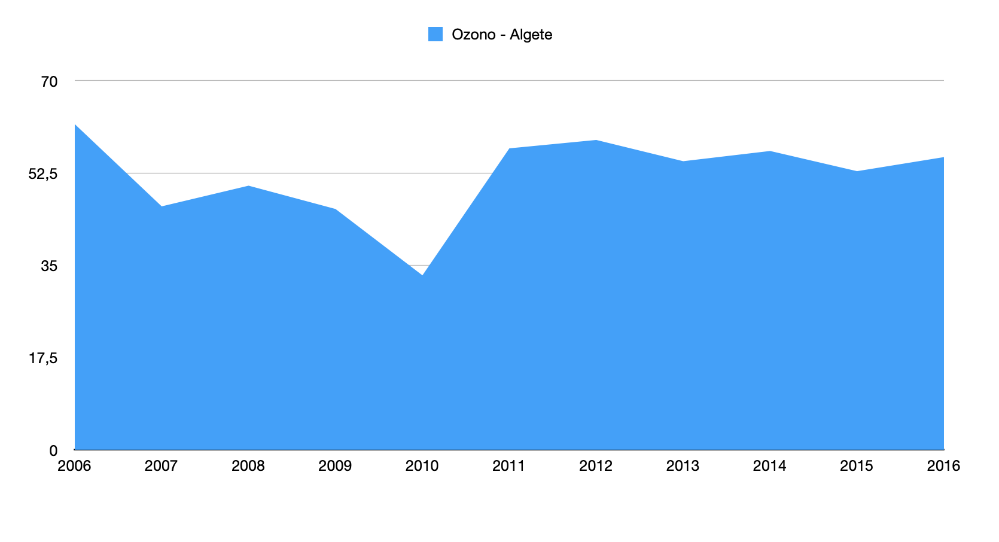

# Práctica 4
## Introducción
Este es un documento explicativo sobre la **práctica 4** , con los respectivos datos en formato [html](python-api-libre-pandas.html) e [ipynb](python-api-libre-pandas.ipynb)
En este documento **no** se ahondará en cada paso técnico sino de una reflexión sobre la **utilidad y aplicabilidad** de la práctica para un futuro desempeño profesional, así como las dificultades en el proceso.
## Descripción (qué hemos hecho)
Para la práctica 4 se nos pedía que escogiésemos de forma **libre** un conjunto de datos con el que trabajar, **analizásemos los datos**, creásemos una **visualización** y **esbozásemos una historia** con ellos. La metodología se basaría en aquello que ya habíamos hecho en la [práctica 3], diferenciándose en que esta vez éramos nosotros los que buscabamos los datos y que teníamos que esbozar una historia con ellos. De nuevo, trabajamos en un cuaderno de **Jupyter** con **pandas** y lenguaje **JSON**.
## Aplicabilidad (qué entendemos que hemos hecho)
La aplicabilidad queda muy patente en esta práctica gracias al "esbozo de historia" que proponemos. A través de la página de [Kebble] podemos acceder a una gran cantidad de datasets de manera sencilla y gratuita con los que poder trabajar, como ya realicé antes de la corrección de esta práctica con datos del titanic pero que he decidido cambiar.
 

Por último, la historia esbozada deja patente la aplicabilidad de los datos en una información contextual más amplia, en este caso, los peligros de la concentración de O3 en el aire.
## Perspectivas de futuro (qué nos falta por entender)
Volver a hacer una práctica con metodología análoga a la práctica 3 ha servido para **afianzar conocimientos y comprender mejor**. Además, hemos explorado **otras potencialidades** que no hemos visto en clase, como la función `at` 
Sí me gustaría hacer una mención aparte sobre el portal de datos. Otros datos que querramos buscar en otras instituciones no podían ni siquiera abrirse y otras url daban error cuando se intentaban ejecutar. Me parece algo preocupante porque había errores que no eran cuestión de una API en concreto, sino que eran sistemáticos de cada publicador.
